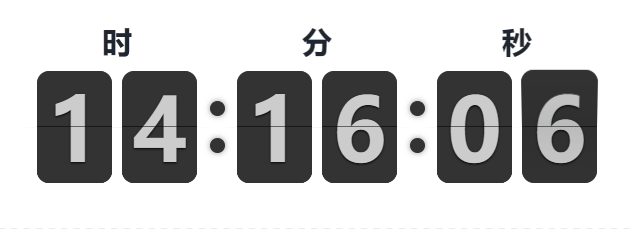
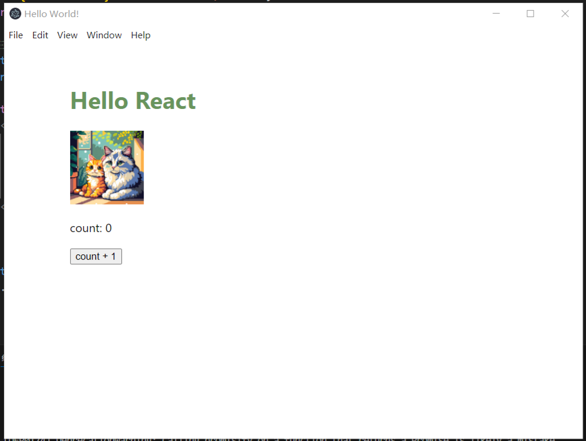

## DEMO

集合一些有趣的自封装组件或工具代码

- 目录
  - [昼夜变换按钮](#昼夜变换按钮)
  - [翻页时钟](#翻页时钟)
  - [snippet](#代码片段)
  - [ele-react-demo](#electron+react+ts模板)

### 昼夜变换按钮

### 翻页时钟

### 代码片段

- `colorConverter` — 常见颜色空间转换算法

- `DatePlus` — Date增强类

### electron+react+ts模板

